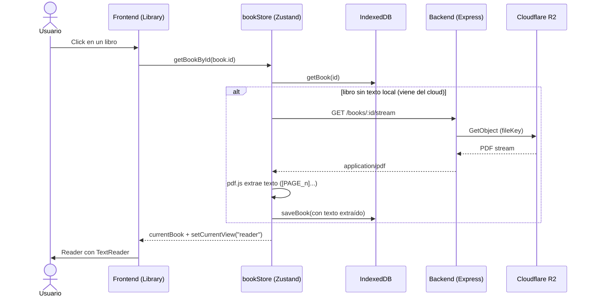
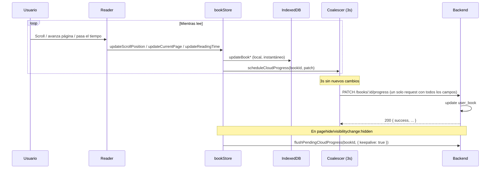

# 1. Flujo de lectura (abrir y progresar un libro)

**Descripción**: El usuario abre un libro desde su biblioteca, el cliente descarga/extrae el texto del PDF si hace falta, y el progreso (página, scroll, tiempo) se persiste localmente y se sincroniza con la nube.

**Actores**: Usuario, Frontend (React/Tauri), Backend (Express), R2, IndexedDB

**Tablas involucradas**: `user_books`, `books`, `bookmarks`, `session` (auth)

**Endpoints**: `GET /books`, `GET /books/:id/stream`, `PATCH /books/:id/progress`

## Diagrama (apertura)

## Diagrama (progreso)

## Reglas clave

1. El **progreso local es instantáneo** (IndexedDB); el cloud se actualiza con coalescing (máx 1 PATCH cada 3s).
2. El **merge** (`syncBooksFromCloud`) conserva el mayor entre local y cloud (`readingTimeSeconds`, `scrollPosition`, `currentPage`, `lastReadAt`).
3. El **stream** es la única forma de obtener el PDF (protege R2 y evita CORS).
4. Los **bookmarks** se guardan con la página actual del reader; el color es solo local.

## Errores a manejar

- Stream falla (red/R2) → el libro queda con texto vacío y se reintenta al volver a abrir.
- PATCH falla (offline) → el coalescer loguea el error; el próximo flush reintenta. El progreso local nunca se pierde.
- `pagehide` con `keepalive` garantiza que la posición final llegue aunque se cierre la app.

## Tests sugeridos

- Apertura de libro con texto local vs sin texto (descarga del stream).
- Merge: local > cloud y cloud > local.
- Coalescer: N updates en 3s → 1 PATCH.
