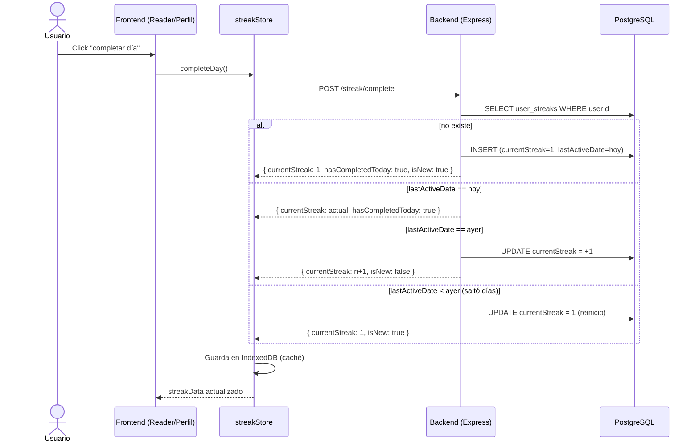
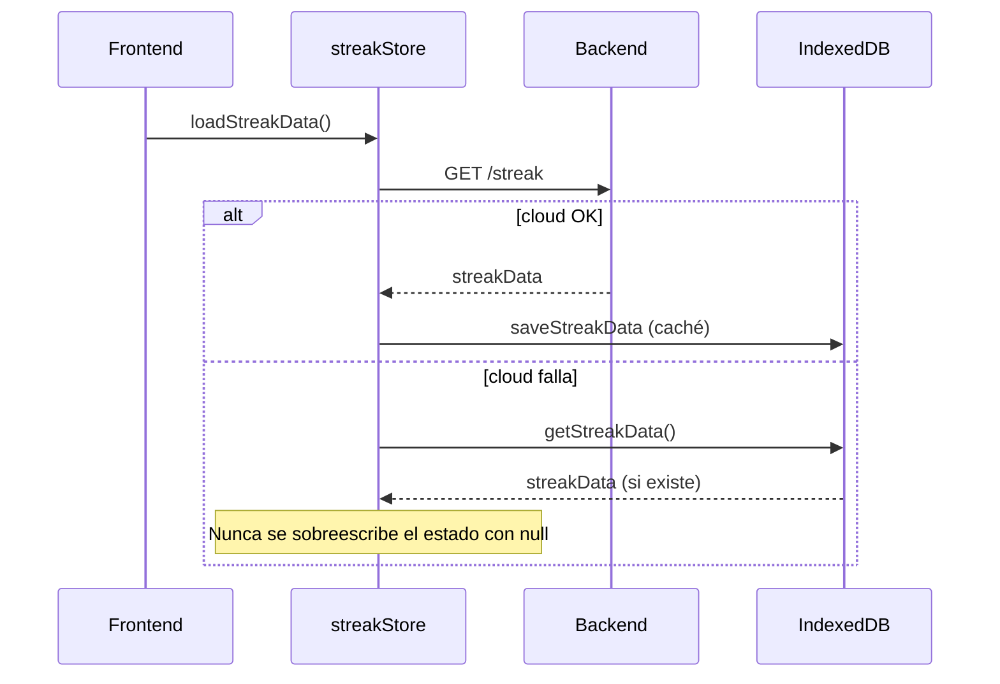

# 2. Sistema de rachas (complete day)

**Descripción**: El usuario completa el día de lectura. El backend calcula la racha (continuación o reinicio) usando la fecha del cliente para evitar problemas de timezone.

**Actores**: Usuario, Frontend (StreakButton/StreakCard), Backend (Express)

**Tablas involucradas**: `user_streaks`

**Endpoints**: `GET /streak`, `POST /streak/complete`, `POST /streak/initialize`

## Diagrama

## Diagrama (carga inicial)

## Reglas clave

1. **La nube es la fuente de verdad**; IndexedDB es caché para offline.
2. `completeDay` acepta `clientDate` (YYYY-MM-DD) para que la racha cuente el día del cliente y no el UTC del servidor.
3. El reinicio a 1 es intencional (leer con días de por medio rompe la racha).
4. `hasCompletedToday` evita doble conteo en el mismo día.

## Errores a manejar

- Sin conexión: fallback local con la misma lógica (comparar fechas a medianoche).
- Doble click: el segundo `complete` devuelve `hasCompletedToday: true` sin incrementar.

## Tests sugeridos

- Día consecutivo → +1.
- Salto de día → reinicio a 1.
- Mismo día → sin cambios.
- Timezone: `clientDate` del cliente gana sobre la fecha del servidor.
